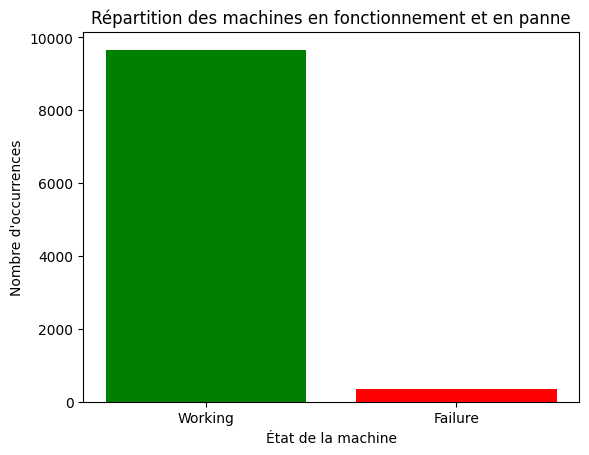
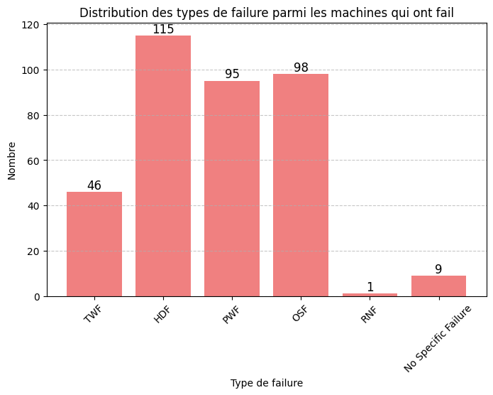
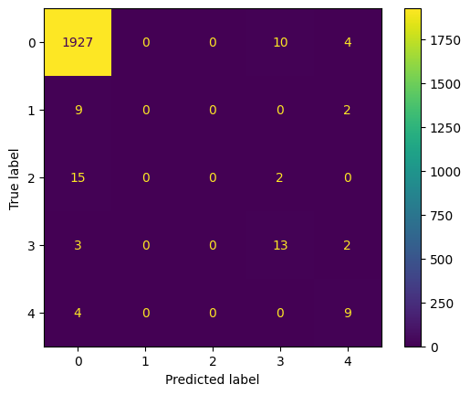
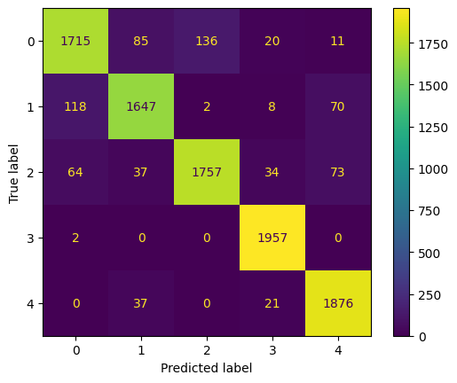
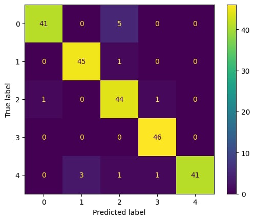

# IA_EMBARQUEE_Predictive_maintenance
 
## Introduction

Aujourd'hui, la maintenance prédictive est incoutournable dans les industries de pointe. L'objectif est d'éviter des pannes impromptues et non anticipées qui retaderaient la production avec des conséquences économiques. L'idée de la maintenance préventive est d'analyser le comportement d'une machine pour déterminer une panne potentielle et agir en conséquence.   
Pour effectuer de la maintenance préventive plusieurs approches existent. Tout d'abord, on peut simuler le comportement méchanique et électrique de la machine pour anticiper des pannes, cette technique est très complexe à mettre en place et oblige à des approximations. Une autre approche est une méthode data-driven. On récolte des données sur les machines et on interprète ces données passées pour identifier des pannes éventuelles dans le présent.   
C'est cette seconde méthode que nous allons mettre en place. Nous souhaitons créer un modèle d'intelligence artificielle pour identifier une panne potentielle via des paramètres de la machine. L'idée est de simuler un système mis en place dans une usine de fabrication de semi-conducteurs. Pour faire cela il est possible de faire remonter toutes les informations des capteurs à un serveur centralisé pour les interpréter ce qui oblige à avoir un stockage énorme et des connexions réseau. Sinon, on peut faire de l'IA en local sur la machine avec un RNN de petite taille utilisant en direct les données de la machine étudiée. Avec cette seconde méthode on peut ensuite mettre en place une architecture féderée en faisant remonter les informations à un serveur qui réentraîne un réseau de neurone en prenant en compte les nouvelles données des machines afin d'améliorer la précision du système.  

Nous souhaitons donc d'intégrer en embarqué sur une carte STM32L152CC76 un réseau de neurone. Pour cela nous nous baserons sur un dataset labellisé qui va nous indiquer le bon fonctionnement ou non de la machine et le type de pannes pour différentes situations.  
Puisque nous n'avons pas de machine de fabrication de semi-conducteurs sous la main nous simulerons ensuite l'envoi de données à la carte STM32 via un programme Python.  
Dans ce README nous allons détailler toutes les étapes de conception du système de maintenance prédictive via une intelligence artificielle embarquée et présenter nos résultats.

## Conception du modèle d'intelligence artificielle pour la maintenance prédictive
L'intégralité du développement du réseau de neurone est faite dans le jupyter Notebook "TP_IA_embarquée.ipynb" où les différentes étapes sont détaillées avec les codes correspondants.  
Analysons les grands points de ce travail.
### Les données d'entrée
Pour ce projet nous disposons d'un Dataset de données d'entrée dont on peut voir les premières lignes ci-dessous.

<table border="1" class="dataframe">
  <thead>
    <tr style="text-align: right;">
      <th></th>
      <th>UDI</th>
      <th>Product ID</th>
      <th>Type</th>
      <th>Air temperature [K]</th>
      <th>Process temperature [K]</th>
      <th>Rotational speed [rpm]</th>
      <th>Torque [Nm]</th>
      <th>Tool wear [min]</th>
      <th>Machine failure</th>
      <th>TWF</th>
      <th>HDF</th>
      <th>PWF</th>
      <th>OSF</th>
      <th>RNF</th>
    </tr>
  </thead>
  <tbody>
    <tr>
      <th>0</th>
      <td>1</td>
      <td>M14860</td>
      <td>M</td>
      <td>298.1</td>
      <td>308.6</td>
      <td>1551</td>
      <td>42.8</td>
      <td>0</td>
      <td>0</td>
      <td>0</td>
      <td>0</td>
      <td>0</td>
      <td>0</td>
      <td>0</td>
    </tr>
    <tr>
      <th>1</th>
      <td>2</td>
      <td>L47181</td>
      <td>L</td>
      <td>298.2</td>
      <td>308.7</td>
      <td>1408</td>
      <td>46.3</td>
      <td>3</td>
      <td>0</td>
      <td>0</td>
      <td>0</td>
      <td>0</td>
      <td>0</td>
      <td>0</td>
    </tr>
    <tr>
      <th>2</th>
      <td>3</td>
      <td>L47182</td>
      <td>L</td>
      <td>298.1</td>
      <td>308.5</td>
      <td>1498</td>
      <td>49.4</td>
      <td>5</td>
      <td>0</td>
      <td>0</td>
      <td>0</td>
      <td>0</td>
      <td>0</td>
      <td>0</td>
    </tr>
    <tr>
      <th>3</th>
      <td>4</td>
      <td>L47183</td>
      <td>L</td>
      <td>298.2</td>
      <td>308.6</td>
      <td>1433</td>
      <td>39.5</td>
      <td>7</td>
      <td>0</td>
      <td>0</td>
      <td>0</td>
      <td>0</td>
      <td>0</td>
      <td>0</td>
    </tr>
    <tr>
      <th>4</th>
      <td>5</td>
      <td>L47184</td>
      <td>L</td>
      <td>298.2</td>
      <td>308.7</td>
      <td>1408</td>
      <td>40.0</td>
      <td>9</td>
      <td>0</td>
      <td>0</td>
      <td>0</td>
      <td>0</td>
      <td>0</td>
      <td>0</td>
    </tr>
  </tbody>
</table>

Les entrées sont : 
- UDI : l'identifiant
- Product ID : le produit
- Product type : le type de produit
- Air temperature : la température de l'air dans la machine
- Process temperature : la température interne
- Rotational speed : la vitesse de rotation
- Torque : le couple
- Tool wear : usure de l'outil (nombre de minutes d'utilisation)
- Machine failure : un booléen indiquand si on a une panne

Nous avons donc des données caractérisant les machines en fonctionnement et en panne que nous souhaitons utiliser pour prédire des pannes.
Avant toute chose il est important de constater que la très grande majorité des données correspond à des machines fonctionnant correctement. Les pannes correspondent à uniquement 3,39% des données (339 données). Cela va donc compliquer l'entraînement du modèle.
Nous pouvons observer la distribution des données sur le graphique ci-dessous.

Nous récupérons également le nombre de pannes de chaque type que nous traçons sur le diagramme ci-dessous. Notons que les pannes non définies (RNF) ne sont pas comptabilisées comme des pannes dans le Dataset (sauf pour une donnée, probablement dûe à un Dataset imparfait).

Il est important de garder en tête que nous souhaitons prédire un type de panne. Les pannes aléatoires sont par définition imprévisibles. Elles sont donc exclues du Dataset utilisé pour la conception du modèle.

Nous avons comme sorties :
- machine failure (0 ou 1)
- le type de failure (TWF, HDF, PWF, OSF, RNF qui sont à 0 ou 1)

Nous excluons donc RNF ainsi que les No Specific Failure qui sont des défauts dont la cause n'est pas identifiée.

Nous souhaitons créer une classe No Failure qui correspondra au cas où il n'y a pas de défaut. Nous créons donc une nouvelle colonne dans le Dataset avec :
**dataset['No Failure'] = 1 - dataset["Machine failure"]**

Ensuite, pour les entrées, nous conservons uniquement les entrées caractérisant le comportement de la machine, nous enlevons donc les 3 premières colonnes (l'identifiant et des informations sur le produit en cours de traitement).
### Conception du réseau de neurone
#### Les prédictions souhaitées

Notre objectif est de prédire l'appartenance à une catégorie de Failure (ou indiquer l'absence de risque) en fonction des données d'entrée.

Nous souhaitons donc mettre en place un réseau de neurone multi-classe. Il devra prédire l'appartenance à une classe et chaque élement pourra être associé à uniquement une classe.

Les classes de sortie sont : 
*   **0:NF**: No Failure
*   **1: TWF**: Tool Wear Failure
*   **2: HDF**: Heat Dissipation Failure
*   **3: PWF**: Power Failure
*   **4: OSF**: Overstrain Failure

#### Equilibrage du Dataset
Comme vu sur le graphique en première partie de ce document, notre Dataset n'est pas du tout équilibré avec 97,61% des données correspondant à la classe 1 (No Failure).

Conscients du problème, nous essayons tout de même d'entraîner un modèle avec ce Dataset non équilibré.
Nous voyons que, que l'on utilise un modèle très performant ou alors très simple, nous arrivons rapidement à 97% d'Accuracy. On peut déjà se douter qu'il y a un problème puisque 97% est la proportion des données dans la classe No Failure.
En traçant la matrice de confusion nous voyons bien que le modèle va constamment prédire la classe 0 puisqu'elle représente la grande majorité des cas.

Nous avons donc un modèle d'apprentissage automatique qui n'apprend pas et donne quasi systèmatiquement la même classe de sortie.

Nous allons donc balancer le Dataset. Pour cela nous disposons de plusieurs méthodes mais nous choisissons le SMOTE (Synthetic Minority Over-sampling Technique) qui consiste à génerer des nouvelles données à partir de celles existantes. Ainsi, en se mettant en mode Automatique, toutes les classes vont être équilibrées avec un nombre de données par classe correspondant au maximum de données dans une classe. 
De nouvelles données sont générées en interpolant linéairement entre un exemple sélectionné et l’un de ses voisins proches. Il ne s'agit pas d'un simple sur-échantillonage, on évite donc la duplication des données. Cependant, comme vu en cours. Cela peut introduire du bruit si les données des classes minoritaires sont trop dispersées ce qui ne semble pas être le cas ici.
Par exemple, les 115 valeurs de TWF vont être extrapolées pour obtenir 9670 valeurs (le nombre de No Failure).

Nous obtenons donc un Dataset avec 9670 valeurs pour les 5 classes et qui n'a donc plus de classe sur-représentée.

#### Architecture du modèle
Nous séparons les données du Dataset en 2 catégories : les données d'entraînement et les données de test. Nous utilisons 80% du Dataset pour l'entraînement et 20% pour le test. Nous ne prenons pas de données de validation.

Après avoir testé un CNN (Convolutionnal Neural Network) nous n'avons pas obtenu de résultats satisfaisants. En effet même avec de nombreuses couches, l'Accuracy restait de l'ordre de 30% ce qui correspond quasiment à du hasard avec 5 classes.

Nous nous sommes donc orientés vers un MLP (Multilayer Perceptron).
La couche d'entrée a pour dimension la dimension des données d'entrées donc 5.
En s'inspirant des projets déjà réalisés avec des MLP nous mettons 3 couches cachées de 32 à 64 neurones avec comme fonction d'activation Relu.
Enfin, nous avons un problème de classsification multi-classe. Nous utilisons donc une couche de sortie à 5 neurones (le nombre de classes en sortie) avec la fonction d'activation SoftMax.
Softmax va donner une probabilité d'appartenance à chacune des classes entre 0 et 1.

Pour connaître la classe la plus probable nous prenons celle avec la plus grande probabilité.

#### Test du modèle
Nous entraînons ce modèle avec les données préalablement équilibrées. En effectuant 40 époques d'entraînement nous atteignons une précision d'environ 92%. Nous pouvons ensuite vérifier que les résultats sont corrects grâce à la matrice de confusion ci-dessous.
La diagonale correspond aux bonnes prédictions. Chaque classe contient Nous voyons bien que notre système se comporte très bien même si il y a des erreurs 

Nous avons tout de même voulu nous assurer que la précision du modèle n'étaient pas liée à une mauvaise utilisation du SMOTE. Ainsi, dans ce cas le modèle pourrait prédire correctement avec les données provenant du SMOTE mais pas les vraies données (qui seraient alors parmis les quelques erreurs).
Nous retraçons donc une matrice de confusion en équilibrant les données provenant de la machine. Nous utilisons pour cela RandomUserSample en mode not minority qui va réduire le nombre de données dans la classe 0.

Nous obtenons alors la matrice ci-dessous (qui est basée sur uniquement 370 données. 

Nous obtenons alors de bonnes prédictions ce qui fait que notre modèle est performant.

Pour conclure, nous avons un modèle d'IA pour la maintenance prédictive avec une précision supérieure à 90%. Nous allons maintenant chercher à le transférer sur une carte STM32 pour unt utilisation en embarqué.

## Inférence sur dispositif embarqué
### Transfert du modèle sur STM32
Nous souhaitons utiliser notre modèle sur une carte STM32 (une STM32L152 dans notre cas).   
Pour cela nous allons l'exporter depuis le Jupyter Notebook. Bien que l'export au format h5 soit conseillé nous l'exportons au format TensorFlow puisque les différentes librairies utilisées ne permettent pas un export au format h5 d'une version compatible avec la carte.  
Nous travaillons ensuite sur CubeIDE et plus précisément avec CubeMX.  
Nous activons X-Cube-AI dans la catégorie Software Package de l'IOC. Ensuite nous créons un nouveau modèle via l'onglet +.  
Nous choisissons comme modèle d'entrée TFLite et importons notre modèle improved_mlp_model.tflite. Nous exportons ensuite les données d'entrée.  
Les données se trouvent dans le dossier exported_data. X_test et Y_data correspondent aux données avec SMOTE de dimension 9670 et X et Y correspondent aux données brutes venant de la machine (sans SMOTE) mais équilibrées pour ne pas que la classe 0 (No Failure) soit prédominante.  
Les données de sortie exportées sont les données avec une seule colonne indiquant l'index de la classe déterminée. En effet, le modèle ressort des données binaires à 5 colonnes caractérisant l'appartenance à une classe. Cependant le modèle embarqué renverra uniquement un entier afin de ne pas surcharger l'UART. Nous comparerons donc la sortie du modèle à la donnée de sortie mono-label.

Nous n'activons pas la compression et mettons l'optimisation sur Balanced.  
Nous cliquons ensuite sur Analyze.  
Si besoin nous pouvons effectuer la validation. Pour cela il faut récupérer les données d'entrées X ainsi que les données de sorties mono-label. 

On voit en effectuant l'exécution que le modèle prend uniquement 10,27KiB sur la Flash et 20,79KiB sur la RAM en utilisant une carte STM32L152.

Notre modèle est maintenant importé. Nous pouvons gérer l'inférence dans le fichier app_x-cube-ai.c.

### L'interaction avec le réseau de neurone

La fonction permettant de lancer l'utilisation du réseau de neurone est MX_X_CUBE_AI_Process à mettre dans la boucle infinie de main.c.  

De plus, dans la version de STM32CubeIDE utilisée pour ce projet il est nécessaire de commenter MX_SDMMC1_SD_Init et MX_USB_OTG_FS_PCD_Init dans les initialisations puisque ces fonctions sont bloquantes et empêchent le déroulement du programme en l'absence d'une carte SD (qui n'est pas nécessaire dans notre cas).

Le fichier intéressant est app_x-cube-ai.c. C'est ici que l'interaction avec le modèle va être effectuée.

Dans notre cas nous allons recevoir des données depuis l'UART qui sont envoyées via un script Python. Ces données sont 5 flottants.

Le programme suit un déroulement précis : 
- synchronisation initiale avec le périphérique
- réception et traitement des données issues du modèle d'intelligence artificielle
- sélection de la classe la plus probable 
- transmission de cette information.

Le programme embarqué commence par établir une synchronisation avec un périphérique distant via l'UART. Cette synchronisation est assurée par la fonction synchronize_UART, qui attend un signal de synchronisation de la part du périphérique (0xAB par défait). Lorsque ce signal est reçu, le microcontrôleur répond par un accusé de réception (0xCD), indiquant que la communication est bien établie. Une fois cette étape complétée, le programme peut procéder à la transmission et au traitement des données.
Pour cela on commence par préparer les données qui sont initialement des float sur 32 bits codés comme des octets entiers (du fait de la transmission via l'UART). On doit donc les reconstruire comme cela est fait dans acquire_and_process_data. Les données reconstruites qui correspondent à 20 octets au total (4*5) sont ensuite envoyées au modèle.  
Le traitement est lancé via ai_run. Dans le tableau de résultat on retrouve la probabilité d'apprtenance à chacune des 5 classes de sortie.

La fonction de post-traitement des données est post_process. Cette fonction commence par vérifier si les données de sortie du modèle sont bien présentes. En l'absence de données valides, elle génère un message d'erreur et met fin à l'exécution. Si les données sont correctes, elles sont extraites et stockées sous forme de valeurs flottantes.  
Le programme détermine alors la classe dominante en comparant les probabilités associées à chaque catégorie, sélectionnant celle ayant la valeur maximale. Cette classe est ensuite convertie en un format compatible avec la transmission UART. On obtient alors l'indice de la classe choisie (entre 0 et 4).

Après avoir identifié la classe prédominante, le programme se charge d'envoyer cette information via l'UART à l'aide de la fonction HAL_UART_Transmit. Cette dernière envoie la classe détectée au périphérique connecté, qui pourra alors utiliser cette information pour une prise de décision. Dans notre cas nous mesurerons la précision du modèle via un programme python. Nous pouvons également utiliser ces données en interne du microcontrôleur.

### L'envoi des données à la carte
L'envoi des données est effectué via le port COM et commandé par le script python python_to_send_data.

Le programme commence par charger les données de test X_test et Y_test depuis des fichiers .npy. Ces données représentent les entrées du modèle et les sorties attendues respectivement. Une connexion série est ensuite établie avec le STM32 via le port spécifié.
On peut choisir entre les données obtenues avec le SMOTE qui sont ._TEST.npy avec 9670 données et les données provenant directement du Dataset mais avec des classes équilibrées (360 données).

Avant d'envoyer des données, la fonction synchronise_UART  envoie un octet spécifique (0xAB) et attend une réponse (0xCD). Tant que cette réponse n'est pas reçue, l'envoi est répété, et les éventuels octets résiduels dans le buffer série sont ignorés.

La fonction send_inputs_to_STM32 est responsable de l'envoi des entrées du modèle. Elle prend le tableau numpy d'entrées, le convertit en type float32 et en extrait les octets binaires avant de les envoyer sur le port série.

Après l'envoi des entrées, la fonction read_output_from_STM32 récupère la réponse du microcontrôleur. Il s'agit d'un seul octet (uint8_t), qui est le label de classification renvoyé par le modèle de machine learning exécuté sur le STM32. 
On calcule ensuite la précision du modèle en incrémentant à chaque itération de la valeur 1/nombre d'itérations. On affiche ensuite le résultat et on indique qu'il y a eu erreur lorsque c'est le cas avec le résultat reçu et celui attendu.

Le nombre d'itérations est à mettre en paramètre de la fonction evaluate_model_on_STM32. Il ne peut pas être supérieur au nombre de données dans le tableau.  

## Les résultats sur le dispositif embarqué

Au final nous arrivons bien à envoyer des données provenant du Dataset au modèle embarqué qui nous renvoie les résultats sous la forme d'un entier que l'on peut ensuite comparer avec la réalité.

Nous obtenions environ $93\%$ de précision avec le modèle sur le Jupyter Notebook. Cette précision varie selon les entraînements puisque le modèle d'apprentissage évolue différemment.  
Ensuite, lorsque nous l'envoyons sur la carte et que nous le testons avec les mêmes données d'entraînement que sur le Jupyter Notebook nous obtenons une précision de $93\%$ et $90\%$ en envoyant les données X.npy qui sont celles provenant directement du Dataset sans données générées artificiellement via le SMOTE mais qu'on a équilibré.  

Nous obtenons d'excellents résultats avec notre modèle embarqué, cependant il est nécessaire de rester critiques à propos de ces résultats.  
En effet les données envoyées sur la carte sont les mêmes que celles qui ont servi à l'entraînement, le modèle pourrait donc faire de l'Overfitting et nous ne savons pas exactement comment il se comporterait avec de nouvelles données.  
Ensuite, en essayant rapidement avec le Dataset d'entrée non-équilibré que nous envoyons sur la carte nous voyons que le modèle a une précision de l'ordre de 80%. Le problème principal est qu'il invente des défauts sur des situations sans défauts.  Ainsi peut être que d'autres méthodes d'entraînement du modèle auraient permis de minimiser cette erreur. Cependant, nous pouvons tout de même dire qu'il est moins grave de détecter une erreur en trop que de ne pas la détecter.  
Une piste d'amélioation serait également d'analyser plus en détail le retour du modèle. Actuellement nous choisissons comme résultat la classe avec la plus grande probabilité mais analyser en détail les probabilités données pourrait nous donner un indicateur de confiance sur le résultat.   
Par exemple si nous avons 41% de probabilité de panne TWF mais 40% de probabilité de No Failure, TWF sera choisi mais il serait important d'être critique sur ce résultat.

## Manuel de lancement et utilisation
Pour utiliser ce projet il est nécessaire de récupérer l'intégralité du dossier GitHub.  

### Géneration du réseau de neurone
Si vous souhaitez regénerer un modèle IA il est nécessaire de lancer l'intégralité du Jupyter Notebook. Cependant la partie 2 et le premier modèle servent uniquement à montrer que l'équilibrage des classes est nécessaire.  
Pour pouvoir récupérer la dernière version du modèle exporté il faut décommenter le paragraphe dans l'avant dernière cellule du document.  

Ensuite, le lancement 